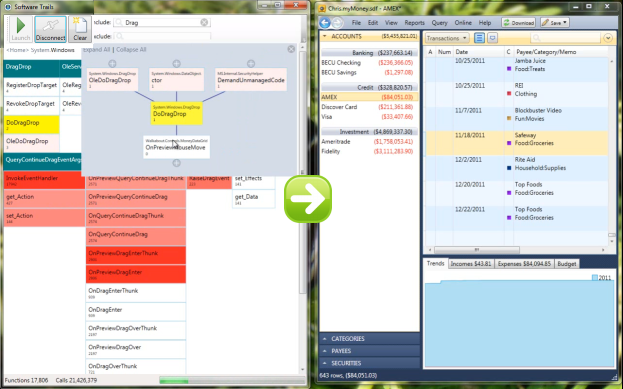

# SoftwareTrails

Click here to install the [SoftwareTrails tool](http://www.lovettsoftware.com/downloads/softwaretrails/softwaretrails.application).

Have you ever wanted to see what is going on in your program in real time?  I built a light weight profiling tool that shows you exactly that. Let me show you how it works.  To get started you click the Launch button and find the application you want to profile and immediately we see a bunch of activity showing what’s happening as the app launches.  This dashboard is showing a roll up across the top level Namespaces and the counters are showing the total number of function calls in each area.
You can scroll down and see everything that is going on.  We can see that there are some Microsoft namespaces, but there’s also a Walkabout namespace which happens to be the code for this application.  So I can take a look at startup again without the .NET frameworks by drilling down into the Walkabout namespace – this shows me the drill down path and the green blocks represent classes and namespaces and the white blocks represent method calls.  

So we can now see that we’re getting down to the method call level – maybe we’re interested in seeing what happens during LoadConfig and we can click that method and it will search the call information and build a conglomerate call stack graph basically showing a combination of all call stacks that it has seen involving that method Loadconfig.  And from this you can actually explore down into WPF or you can explore upwards and see what those function calls are doing.  You can also try and expand the entire graph but in this case it’s not recommended because the graph is huge.  When you’re done exploring the call stack you can close that and go back to the dashboard.

You can also Filter this information – so maybe I care about anything involving the word “Transaction” and I can see that during the launching of the application that there’s some Transactions Namespaces and I can also see that it shows up over here in the View namespace.  Let’s drill down into some controls and we see a class named TransactionView.  
At any point you can clear the buffer and start over and go back to <Home> and remember to clear the filter.  When I do that I can see that there’s actually a heart-beat going on with this application and the reason for that if I drill into the MainWindow is that there’s an OnTick method that is being fired by a DispatcherTimer.  

Ok, let’s go back over here and let me show you more about this application that I’m profiling.  Let me just disconnect for a second (you can disconnect at any time if you want to just pause the profiling).  I’m going to load some sample data into this application.  It’s basically a personal finance application like Quicken and I’m going to show you the real scenario that I’d like to debug, so now I have some sample data, the scenario that I want to debug is drag/drop – I want to find out why drag drop isn’t working in this window here.  Alright, so I can now reconnect back to that application, the profiler is ready for work, probably want to go back home, and let’s run the drag/drop scenario.  We see a lot of activity, 16 million function calls already, even after clearing the buffer, I see some stuff in the Walkabout namespace, and the System namespace, so let me apply a filter again and just search for anything containing the word “Drag”.

Now I could look at the Walkabout code, but first I want to take a look at the .NET frameworks.  So in the history of calls that we have in the buffer, this is everything that WPF does to implement Drag/Drop.  This gives me a really great place to start looking up documentation on MSDN to find out what these methods do, OnDragOver, OnDragEnter, OnDragLeave and so on, and also I see a method called DoDragDrop which sound like an interesting place to start, let’s take a look at that method, and if I look at the caller, well it’s this class called MoneyDataGrid.  So now we know the class over here in the UI is called MoneyDataGrid.
So now if we go back to the Walkabout namespace, there I can see the Controls namespace and the Views namespace and I can see the classed called MoneyDataGrid.  This is the guy that starts the drag/drop operation – so let’s remove the filter and take a closer look at everything he’s doing.  He’s getting the mouse move which begins the drag/drop operation and here we see a flag called “get_SupportDragDrop” and we see the OnQueryContinueDrag method which the MSDN documentation tells us is used by WPF to figure out whether the drag/drop operation should continue.  So let’s select OnQueryContinueDrag and see what it calls.  Now I have an excellent place to go and look in the code  - it’s in MoneyDataGrid, to find out why when I drag this window nothing happens.
Now if I clear the buffer and do it again, now I can see in real time a lot of these mouse moves come in, I see the call to get_SupportDragDrop and so on.  So being able to see in real time what’s happening, for example, when I do mouse moves, it’s is a really useful way to see what’s going on in my code. 

I can also see that when I wiggle the mouse there are lots and lots of function calls, so if I’m worried about performance at all, that counter down there, plus the rollup for each Namespace is going to be a great way to figure out where I need to optimize and see if I can remove some of those calls and get better performance.  

## Profiling Very Large Applications

Ok, enough of that application.  Now what about a bigger application?  I’m going to launch Visual Studio - Visual Studio consists of a huge amount of code.  I want to see what the overhead then is of the profiler in launching Visual Studio.  Already we can see all the .NET framework stuff that’s happening, and Visual Studio is already up and running in about 10 seconds.  So we can also see here that in order to launch Visual Studio it takes about 46 million function calls, but there’s only about 15 thousand unique functions.  Again, here’s the top level view, I can see the Microsoft.VisualStudio namespace, which is where all the Visual Studio code lives so I can drill down and re-run the launch scenario and I can see everything that happens in the Microsoft.VisualStudio namespace when it launches.  I can see stuff in the Platform, in the Shell, there’s some Packages, let’s see what package is doing, and drill down, and so on.

The breadcrumb toolbar allows you to go jump back up to any level that I want.  Let’s go back to VisualStudio.  
Now the same thing can be done – let’s say I want to explore a drag/drop scenario inside Visual Studio with the “Drag” filter.  First let’s clear the 50 million function call history, that was quick, and let’s load a DGML graph so we can explore drag/drop in DGML.  First off when I load the graph I can already see a bunch of classes, “GraphDragDrop”, and “DragSourceGesture” and these are getting fired up inside Visual Studio, so that’s promising.  Those things will probably add drag/drop support.  Let’s zoom in and grab one of these nodes, and do a drag/drop.  Just as before I’m able to see in real-time everything that’s happening – the DragSourceGesture did a lot of work, let’s drill into that and take a look at that again, ok, I’ve got too much stuff in my buffer, let’s clear that and do the drag/drop again, and instantly we see exactly what’s happening deep down inside Visual Studio to support that Drag/Drop operation and now I know where to find the code and set breakpoints and continue my debugging.
So I think you’ll find that this profiler scales up to some pretty big software.  
Testing

I think this tool will also make a great testing companion.  For example, if you own a document editor then there’s a special call deep down in the VS shell called “ReleaseDocument” that needs to happen when your document window is closed.  Bang, all right, so deep inside this Visual Studio namespace,  inside WindowManagement, there should be a call to ReleaseDocument.  If that doesn’t happen you have a pretty bad memory leak in your editor.  So this tool is a great way to do an ad hoc test that certain things are happening when they are supposed to 

That’s it, I hope you enjoy it!

